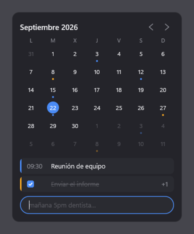
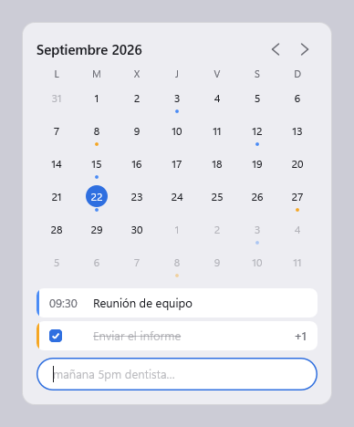
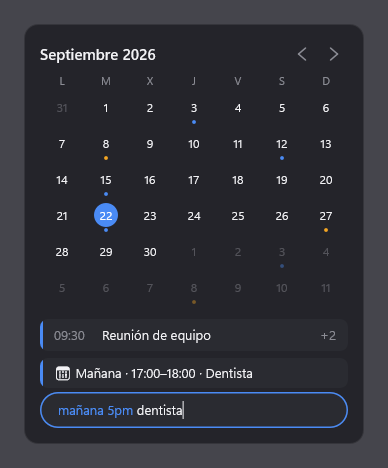
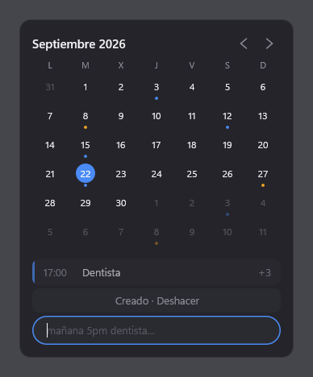
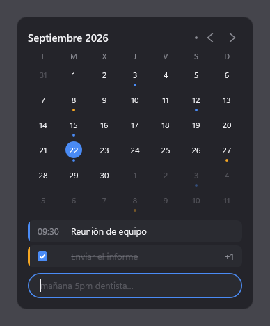

# Agenda

Calendario nativo para Windows 11, escrito en C++ y Win32 puro. Se abre con un atajo global
en un popup compacto sobre la barra de tareas, entiende lenguaje natural (`mañana 5pm
dentista`) y, al hacer clic en el calendario, se expande con animación a una app completa con
vistas de día, semana y mes. Sincroniza con Google Calendar y Google Tasks.

Las decisiones de producto, el stack y el sistema de diseño están en [CLAUDE.md](CLAUDE.md).

## Estado

**Fase 5 terminada; la siguiente es la 6.** Agenda se queda residente en la bandeja, el atajo
abre un popup con fondo acrylic en la esquina inferior derecha del monitor de trabajo, y el
popup muestra el mes, lo que hay ese día y el campo de texto. El panel se adapta al monitor:
su alto es el 42 % del área de trabajo, entre 380 y 560 DIP, y todo lo de dentro escala con
él. Al escribir,
Agenda **entiende lo que lee**: resalta los trozos que reconoce y muestra encima una tarjeta
con lo que se va a crear. **Con Enter lo crea, y sigue ahí al volver a abrir la aplicación**:
todo se guarda en SQLite, en `%LOCALAPPDATA%\Agenda\agenda.db`. Y **se sincroniza en los
dos sentidos con Google Calendar y Google Tasks**: lo creado aquí aparece en el móvil y lo
creado en la web aparece aquí en la siguiente pasada. La interfaz nunca espera a la red, y sin
conexión todo sigue funcionando: lo escrito se guarda igual, un punto discreto en la cabecera
lo dice, y la cola se vacía sola cuando la red vuelve. Los pasos para crear las credenciales
están en [docs/google-setup.md](docs/google-setup.md).

| Tema oscuro | Tema claro |
|---|---|
|  |  |

Agenda sigue el tema de las aplicaciones de Windows, que lee del registro al abrir el popup.

## Requisitos

- Windows 10 1809 o superior, o Windows 11 (x64). El fondo acrylic necesita Windows 11 22H2;
  en versiones anteriores el panel se pinta opaco. Aunque esté disponible, Windows dibuja un
  color plano en vez del material cuando el efecto no se puede calcular: transparencia
  desactivada, ahorro de energía, sesión remota o según el adaptador de vídeo. Eso lo decide
  DWM y le pasa a cualquier ventana, no solo a Agenda.
- Visual Studio 2022 con la carga de trabajo *Desarrollo para el escritorio con C++* (MSVC
  v143 y el SDK de Windows 10/11).
- CMake 3.28 o superior.
- [vcpkg](https://vcpkg.io) con la variable de entorno `VCPKG_ROOT` apuntando a su carpeta.
  Si no está instalado, CMake descarga nlohmann-json y Catch2 con `FetchContent` y el build
  funciona igual; solo hace falta Git y conexión.

## Compilación

```
cmake --preset debug
cmake --build --preset debug
ctest --preset debug
```

Lo mismo con `release`. Los binarios quedan en `build\debug\Agenda.exe` y
`build\release\Agenda.exe`.

Las dependencias salen de vcpkg en modo manifest si hay `VCPKG_ROOT`, y si no, de FetchContent:
nlohmann/json y Catch2 por clon de git, y SQLite como **amalgamación con su hash fijado**. Esa
última llega por HTTPS, así que CMake necesita un almacén de certificados; si el `cmake` del
PATH no trae ninguno, `CMakeLists.txt` le pasa el de Git para Windows y la descarga funciona
sin tocar nada.

### Ejecución

```
build\debug\Agenda.exe --monitor=3
```

Al arrancar no se ve nada: Agenda deja el icono en la bandeja y espera el atajo. Con el
clic izquierdo en el icono se abre el popup; con el derecho aparece un menú con **Abrir**,
**Salir** y, si hay credenciales de Google puestas, **Conectar con Google…** y **Calendario
por defecto**. Si otra aplicación ya usa el atajo, Agenda lo registra en el log, avisa con un
globo en la bandeja y sigue funcionando: se abre desde el icono. Y si la caché no se puede
abrir, lo dice también con un globo en vez de callárselo: una agenda que olvida en silencio
lo que le escriben es peor que una que admite que no puede guardar.

`--monitor=3` es el monitor de desarrollo. Si ese número no existe en la máquina, Agenda lo
registra y **no se abre**: no hay fallback silencioso. Pásale el que haya.

### Cómo se usa el popup

- **Alt+Shift+C** abre y cierra el popup. También se cierra con Esc o al hacer clic fuera.
- Abre siempre en el día de hoy, con el campo de texto enfocado y el cursor esperando.
- **Ratón:** clic en un día para seleccionarlo, clic en `‹` y `›` para cambiar de mes, clic en
  el campo para poner el cursor donde se pinchó. Los días y las flechas se iluminan al pasar
  por encima.
- **Teclado:** con el campo vacío, las cuatro flechas mueven el día seleccionado, `←` y `→` de
  uno en uno y `↑` y `↓` de semana en semana. Con texto escrito, `←` y `→` mueven el cursor
  (con `Shift` seleccionan) e `Inicio` y `Fin` van a los extremos de la línea, mientras `↑` y
  `↓` siguen moviendo el día. `Ctrl+A`, `Ctrl+C`, `Ctrl+X` y `Ctrl+V` hacen lo de siempre.
- Al cambiar de mes, el día seleccionado se mueve con él, así que la lista de abajo siempre
  muestra un día que está en pantalla. Si el día no existe en el mes nuevo, se recorta al
  último que sí (31 de enero más un mes es 28 de febrero).
- La lista muestra hasta dos eventos del día; si hay más, el segundo lleva un `+N` a la
  derecha. Un día sin eventos dice «Sin eventos».
- **Enter crea** lo que dice la vista previa, limpia el campo y la tarjeta nueva entra
  animada. Si el día ya estaba lleno, la lista se desplaza para que la recién creada sea una
  de las visibles, y el `+N` cuenta el resto. Si el evento cae en otro día, el popup salta a
  ese día.
- Durante **cinco segundos** aparece un aviso discreto que dice «Creado · Deshacer».
  **Ctrl+Z** dentro de esos cinco segundos borra lo creado y **devuelve la frase al campo**,
  para poder corregir un error de tecleo en vez de escribirlo otra vez. Cuando el aviso se
  va, la oferta se va con él.
- **Las tareas llevan una casilla.** Un clic en ella la marca y el texto se tacha con una
  línea que se dibuja sola; otro clic la desmarca y la línea se retira. La tarea sigue en la
  lista: tachada, no desaparecida.
- La lista mezcla eventos y tareas y se lee como la forma del día: primero lo de día entero,
  después todo lo que tiene hora, y al final las tareas sin hora. Una tarea **sin fecha**
  («comprar leche») aparece en el día de hoy, que es lo único que evita que algo creado no se
  vea en ninguna parte.
- Los puntos del mes salen de lo que hay guardado de verdad. Un evento de varios días pone
  punto en todos ellos.

### Escribir en lenguaje natural

Se escribe la frase entera de corrido, en español o en inglés, sin importar el orden ni los
acentos ni las mayúsculas. Los trozos que Agenda reconoce se pintan en azul dentro del campo, y
lo que queda sin pintar es el título. Encima aparece una tarjeta con lo que se va a crear:



| Escribes | Sale |
|---|---|
| `mañana 5pm dentista` | 📅 Mañana · 17:00–18:00 · Dentista |
| `hoy 17:00 dentista` | 📅 Hoy · 17:00–18:00 · Dentista |
| `dentista el viernes a las 3 de la tarde por 2h` | 📅 Viernes · 15:00–17:00 · Dentista |
| `pasado mañana 9 reunión con Ana` | 📅 Pasado mañana · 09:00–10:00 · Reunión con Ana |
| `de 3 a 5 repaso` | 📅 Hoy · 15:00–17:00 · Repaso |
| `el 25 almuerzo` | ☑ Tarea · 25 Oct · Almuerzo |
| `en 3 días pagar el arriendo` | ☑ Tarea · Viernes · Pagar el arriendo |
| `comprar leche` | ☑ Tarea sin fecha · Comprar leche |
| `t: pagar luz el lunes` | ☑ Tarea · Lunes · Pagar luz |
| `gym cada lunes 7am` | 📅 Lunes · 07:00–08:00 · Cada semana · Gym |

De momento, una frase que se repite **guarda su regla pero no se despliega**: el evento sale
solo en su primer día. Desplegar las repeticiones llega con las vistas de semana y mes.

La fecha se escribe como «Hoy», «Mañana», «Pasado mañana» o el día de la semana si cae dentro
de los próximos siete días, y como `25 Oct` si queda más lejos.

Lo que entiende:

- **Fechas:** `hoy`, `mañana`, `pasado mañana`, `lunes`…`domingo`, `próximo lunes`, `el 25`,
  `en 3 días`. En inglés: `today`, `tomorrow`, `day after tomorrow`, `monday`…`sunday`,
  `next monday`, `on the 25th`, `in 3 days`.
- **Horas:** `5pm`, `5 pm`, `17:00`, `17h`, `a las 5`, `5 de la tarde`, `mediodía`,
  `medianoche`. En inglés: `at 5`, `noon`, `midnight`.
- **Duración:** `por 2h`, `30 min`, `de 3 a 5`. En inglés: `for 2h`, `from 3 to 5`.
- **Repetición:** `cada lunes`, `todos los días` (`every monday`, `every day`), que se guardan
  como una regla RRULE.
- **Prefijos:** `t:` o `!` al principio obligan a que sea una tarea; `e:` obliga a que sea un
  evento.

Las reglas cuando la frase no lo dice todo:

- Si hay hora, sale un **evento** de una hora. Si no la hay, sale una **tarea**. El prefijo
  manda sobre las dos.
- Una hora sin `am` ni `pm` se entiende **entre las 8:00 y las 20:00**: `a las 3` son las 15:00
  y `a las 9` son las 9:00.
- Si esa hora ya pasó y no se escribió fecha, se usa la de mañana. Pero si la fecha está
  escrita, se respeta: `hoy 17:00` sigue siendo hoy aunque sean las once de la noche.
- `el 25` es el próximo 25 que haya: el de este mes si no ha pasado, y si no el del siguiente,
  saltando de año en diciembre y saltando los meses que no tienen ese día.
- Un día de la semana suelto puede ser hoy (`martes` un martes es hoy); `próximo martes` es
  siempre la semana que viene.
- Lo que no se entiende no se pierde: se queda en el título. `25:00 reunión` es una tarea
  titulada «25:00 reunión», no las once de la noche.

### Opciones de línea de comandos

- `--monitor=N` fija el monitor por su número de Windows, es decir el dispositivo
  `\\.\DISPLAYN`. El orden de enumeración **no** es ese número.
- `AGENDA_DEV_MONITOR=N` hace lo mismo, y `--monitor` tiene prioridad.
- En builds Debug el valor por defecto es 3, que es el monitor de desarrollo. En Release, sin
  argumento ni variable, se usa el monitor primario.
- `--theme=dark` o `--theme=light` fuerza un tema sin tocar la configuración de Windows. Sin
  el argumento, Agenda sigue al sistema.
- `--panel=WxH` fuerza el tamaño del panel en DIP, por ejemplo `--panel=453x560`, en vez de
  calcularlo desde el monitor. Sirve para juzgar en una pantalla un tamaño que esa pantalla no
  produciría, y vale tanto para la app como para `--render-snapshot`.
- `--text=...` deja el campo de texto ya escrito. Solo tiene sentido con `--render-snapshot`,
  que es la única forma de ver la vista previa en un PNG. Si la frase lleva espacios hay que
  entrecomillarla, y en PowerShell las comillas van **dentro** del argumento:
  `Start-Process ... -ArgumentList '--render-snapshot=popup','"--text=mañana 5pm dentista"'`.
- Si el monitor indicado no está conectado, se registra el error y el proceso termina con
  código **2**. No hay fallback silencioso a otro monitor. Si ya hay otra instancia
  ejecutándose, termina con código **1**.

### Capturas de las vistas

```
build\debug\Agenda.exe --render-snapshot=popup --theme=dark  --out=docs\img\popup.png
build\debug\Agenda.exe --render-snapshot=popup --theme=light --out=docs\img\popup-claro.png
build\debug\Agenda.exe --render-snapshot=popup "--text=mañana 5pm dentista" --out=docs\img\popup-preview.png
build\debug\Agenda.exe --render-snapshot=popup-creado --out=docs\img\popup-creado.png
```

Hay tres vistas: `popup` es el panel tal como se abre, `popup-creado` es el instante siguiente
a pulsar Enter —con el aviso puesto y la tarjeta nueva a medio subir— y `popup-sin-conexion`
es el mismo panel con el punto de sin conexión encendido. La segunda existe porque ese momento
dura ciento sesenta milisegundos y no hay otra forma de mirarlo con calma; la tercera, porque
el punto es tan discreto que hay que poder juzgarlo sin desenchufar nada.



Renderiza la vista fuera de pantalla con Direct2D sobre un bitmap WIC, guarda el PNG y sale.
Así se revisa el diseño: **no con capturas del escritorio**. No necesita monitor ni que la
instancia esté libre, así que funciona con la app abierta. Si falta `--out`, escribe
`shot.png`. Como el acrylic no existe fuera de pantalla, el PNG lleva detrás un gris neutro
que hace su papel, más claro u oscuro según el tema. La captura fija el 22 de septiembre de
2026 a las 10:00 como «ahora» y el panel en su tamaño base de 340×420, para que el PNG solo
cambie cuando cambie el diseño y no cuando cambien el monitor ni la hora.

Ojo: por eso mismo la captura se renderiza siempre a 96 ppp y **no sirve para revisar el
escalado**. Los fallos de DPI solo se ven con la app abierta en un monitor escalado.

Es un ejecutable de subsistema Windows, así que no devuelve el control a la consola: en
PowerShell conviene lanzarlo con `Start-Process ... -Wait` si hace falta esperar al archivo.

### Datos en disco

- Agenda: `%LOCALAPPDATA%\Agenda\agenda.db`, una base SQLite en modo WAL (de ahí los archivos
  `agenda.db-wal` y `agenda.db-shm` al lado). Dentro van los eventos, las tareas, los
  calendarios, el estado de sincronización y la cola de operaciones pendientes de subir.
  Las horas se guardan como **reloj de pared local** —un día y un minuto de ese día—, que
  es lo que guarda también Google Calendar. Se crea sola la primera vez y se migra con
  `PRAGMA user_version`; una base escrita por una versión más nueva de Agenda no se toca.
- Token de Google: `%LOCALAPPDATA%\Agenda\token.bin`, el *refresh token* cifrado con
  **DPAPI**. Va atado a la cuenta de Windows: copiarlo a otro equipo o a otro usuario no sirve
  de nada. Borrarlo es desconectar. El *access token* no se escribe en ningún sitio.
- Log: `%LOCALAPPDATA%\Agenda\logs\agenda-AAAAMMDD.log` (UTF-8, un archivo por día).
- Configuración: `config.json` y, opcionalmente, `config.local.json`, primero junto al
  ejecutable y después en `%LOCALAPPDATA%\Agenda`. Se fusionan en ese orden, así que el
  archivo local manda. Los dos pueden faltar. **`config.local.json` guarda los secretos y
  nunca se sube al repositorio.**

| Clave | Por defecto | Qué hace |
|---|---|---|
| `hotkey` | `"Alt+Shift+C"` | Atajo global. Combina `Ctrl`, `Alt`, `Shift` y `Win` con una letra, un dígito, `F1`–`F24`, `Space`, `Enter`, `Tab` o `Esc`. |
| `popup.openMs` | `160` | Duración de la animación de apertura, en milisegundos. |
| `popup.closeMs` | `120` | Duración de la de cierre. |
| `google.clientId` | — | El ID de cliente OAuth. Sin él, Agenda es un calendario local y el menú de la bandeja no menciona Google. |
| `google.clientSecret` | — | El secreto de cliente. Va en `config.local.json`, nunca en el repositorio. |

`config.example.json` es la plantilla con todas las claves y sus valores por defecto: se copia,
se rellena y se guarda como `config.local.json` en `%LOCALAPPDATA%\Agenda`. La plantilla se
versiona porque no lleva nada dentro; el archivo con los valores, no.

```json
{
  "hotkey": "Ctrl+Alt+Space",
  "popup": { "openMs": 160, "closeMs": 120 }
}
```

Si Windows tiene desactivadas las animaciones (Configuración → Accesibilidad → Efectos
visuales), el popup aparece y desaparece sin animación.

### Sincronización con Google

Las credenciales las creas tú: los pasos están en
[docs/google-setup.md](docs/google-setup.md), y el `clientId` y el `clientSecret` van a
`config.local.json`. Sin ellos Agenda funciona igual, solo que en este equipo, y el menú de la
bandeja no menciona Google en vez de ofrecer algo que no puede funcionar.

Con las credenciales puestas, **Conectar con Google…** abre un aviso que dice que se va a abrir
el navegador y espera confirmación. El permiso se pide con OAuth 2.0 y PKCE, y la respuesta
vuelve a `http://127.0.0.1` en un puerto libre que se cierra en cuanto llega. Se piden tres
permisos y ninguno más: escribir eventos, leer la lista de calendarios —de ahí salen los
nombres y los colores— y las tareas.

Cuándo sincroniza:

- Al abrir el popup, si hace más de **60 segundos** de la última vez.
- Cada **5 minutos** en segundo plano.
- **De inmediato** después de crear, marcar o deshacer algo; ahí solo sube, no baja.

La interfaz nunca espera a la red: todo eso ocurre en un hilo aparte y el popup sigue
apareciendo en menos de 100 ms leyendo la caché local.

Qué se sincroniza:

- **Los calendarios que tengas marcados** en Google Calendar web. El que escondiste allí lo
  escondiste a propósito. **El color de cada evento es el de su calendario.**
- **Eventos** de forma incremental, con `syncToken`. La primera vez baja el calendario entero,
  porque Google no da un `syncToken` a una consulta que lleve un rango de fechas.
- **Tareas** con `updatedMin`.
- En un conflicto **gana el cambio más reciente**, y cada conflicto queda escrito en el log.

**Calendario por defecto**: dónde cae lo que creas. Se elige en el submenú de la bandeja, que
lista tus calendarios con una marca en el activo. Lo que hubieras creado antes de conectar la
cuenta no se queda huérfano: en la primera sincronización se sube al calendario elegido.

**Sin conexión** no se pierde nada. Lo que escribes se guarda en la caché igual que siempre y
queda en una cola; la cabecera del popup enseña un punto pequeño a la izquierda de las flechas,
y nada más, porque no hay nada que hacer al respecto. Cuando la red vuelve, la cola se vacía
sola. Cerrar y volver a abrir Agenda no la pierde: vive en SQLite.



Dos límites que conviene saber:

- **Google Tasks no guarda la hora de una tarea.** Solo el día. Agenda conserva la hora en
  local mientras el día no cambie, pero en el móvil esa tarea no tendrá hora.
- **Una repetición se guarda y no se despliega** todavía, aquí ni allí: la regla viaja, pero
  Agenda solo enseña el evento en su primer día hasta que existan las vistas de semana y mes.

## Estructura del proyecto

```
src/
  app/      entrada (wWinMain), atajo global, bandeja, monitores y argumentos
  ui/       ventana popup, render D2D, composición, animación y capturas
  nlp/      parser de lenguaje natural (biblioteca estática, sin nada de interfaz dentro)
  data/     SQLite, esquema, modelos y repositorios (biblioteca estática, por lo mismo)
  sync/     OAuth y clientes de Google Calendar y Tasks
  core/     logging, configuración, rutas y utilidades
tests/      pruebas con Catch2
assets/     manifiesto (DPI Per-Monitor v2) e iconos
docs/       capturas y decisiones de arquitectura
```

## Hoja de ruta

| Fase | Qué entrega | Estado |
|---|---|---|
| 0 | Esqueleto que compila, documentación, logging, configuración y regla de monitores | Hecha |
| 1 | Ventana popup con fondo acrylic, atajo global e icono en la bandeja | Hecha |
| 2 | Sistema de diseño y vista de mes compacta con datos de ejemplo | Hecha |
| 3 | Parser de lenguaje natural con vista previa en vivo | Hecha |
| 4 | Almacenamiento en SQLite: eventos, tareas y caché local | Hecha |
| 5 | Sincronización con Google Calendar y Google Tasks (OAuth) | Hecha |
| 6 | Expansión animada a la app completa con vistas de día, semana y mes | Pendiente |
| 7 | Pulido, rendimiento, empaquetado y arranque con Windows | Pendiente |

El detalle de cada fase vive en el plan de fases del proyecto; las fases 3 a 7 pueden ajustarse
sobre la marcha.
