# Agenda

Calendario nativo para Windows 11, escrito en C++ y Win32 puro. Se abre con un atajo global
en un popup compacto sobre la barra de tareas, entiende lenguaje natural (`mañana 5pm
dentista`) y, al hacer clic en el calendario, se expande con animación a una app completa con
vistas de día, semana y mes. Sincroniza con Google Calendar y Google Tasks.

Las decisiones de producto, el stack y el sistema de diseño están en [CLAUDE.md](CLAUDE.md).

## Estado

**Versión 1.0.0: lista para usar a diario.** Se instala con un solo archivo, arranca con
Windows, se configura desde su propia ventana y avisa de los recordatorios de Google con
notificaciones nativas, o en la [Isla](../isla/README.md) si está corriendo. Se maneja entera con el teclado, Narrador la lee, respeta el alto
contraste y el cambio de escala entre monitores.

Agenda se queda residente en la bandeja. El atajo abre un popup con fondo acrylic en la esquina
inferior derecha del monitor donde está el ratón, con el mes, lo que hay ese día y el campo de texto. Al
escribir, Agenda **entiende lo que lee**: resalta los trozos que reconoce y muestra encima una
tarjeta con lo que se va a crear, y **con Enter lo crea**. Todo se guarda en SQLite y **se
sincroniza en los dos sentidos con Google Calendar y Google Tasks**, sin que la interfaz espere
nunca a la red.

| Tema oscuro | Tema claro | Alto contraste |
|---|---|---|
|  |  | 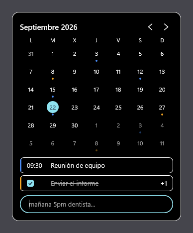 |

Un clic en el mes, o **Ctrl+Enter**, hace crecer **esa misma ventana** hasta la app completa,
con un muelle: no es un corte a otra ventana. El mes se queda donde estaba y pasa a ser la
barra lateral, la lista del día se desvanece, el campo de texto sube a la barra de arriba y la
línea de tiempo aparece alrededor. **Esc** o el botón de contraer hacen el camino inverso.

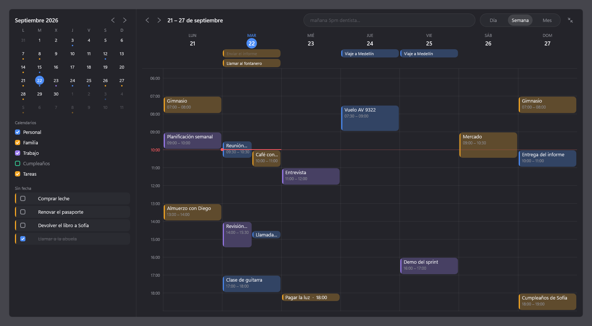

## Instalación

1. Descarga o genera `Instalar-Agenda.exe` (ver [Compilación](#compilación): `empaquetar.ps1`
   lo deja en `build\release\`).
2. Ábrelo. Instala para tu usuario, sin pedir administrador, en
   `%LOCALAPPDATA%\Programs\Agenda`, con un acceso en el menú Inicio y su entrada en
   *Aplicaciones instaladas*. La casilla **Iniciar Agenda con Windows** viene marcada.
3. Al terminar, Agenda arranca. Pulsa **Alt+Shift+C**.

Instalar encima de una versión anterior la actualiza: cierra la que esté abierta, respeta si
tenías el arranque con Windows puesto o quitado, y tus datos no se tocan. Para desinstalar,
*Configuración de Windows → Aplicaciones → Aplicaciones instaladas → Agenda*, o
`Desinstalar.exe` en la carpeta de instalación. Tus datos se quedan en
`%LOCALAPPDATA%\Agenda` salvo que marques «Borrar también mis datos».

Para instalar sin preguntas: `Instalar-Agenda.exe --silent` (con arranque con Windows y sin
abrir Agenda al terminar) y `Desinstalar.exe --uninstall --silent` (que conserva los datos).

Para sincronizar con Google hacen falta unas credenciales tuyas: los pasos están en
[docs/google-setup.md](docs/google-setup.md).

## Requisitos

Para usarla, solo Windows. Para compilarla, además:

- Windows 10 1809 o superior, o Windows 11 (x64). El fondo acrylic necesita Windows 11 22H2;
  en versiones anteriores el panel se pinta opaco. Aunque esté disponible, Windows dibuja un
  color plano en vez del material cuando el efecto no se puede calcular: transparencia
  desactivada, ahorro de energía, sesión remota o según el adaptador de vídeo. Eso lo decide
  DWM y le pasa a cualquier ventana, no solo a Agenda.
- Visual Studio 2022 con la carga de trabajo *Desarrollo para el escritorio con C++* (MSVC
  v143 y el SDK de Windows 10/11).
- CMake 3.28 o superior.
- [vcpkg](https://vcpkg.io) con la variable de entorno `VCPKG_ROOT` apuntando a su carpeta.
  Si no está instalado, CMake descarga nlohmann-json y Catch2 con `FetchContent` y el build
  funciona igual; solo hace falta Git y conexión.

## Compilación

```
cmake --preset debug
cmake --build --preset debug
ctest --preset debug
```

Lo mismo con `release`. Los binarios quedan en `build\debug\Agenda.exe` y
`build\release\Agenda.exe`, y el instalador en `build\release\Instalar-Agenda.exe`. El
atajo para generarlo todo en Release es:

```
powershell -NoProfile -ExecutionPolicy Bypass -File empaquetar.ps1
```

Las dependencias salen de vcpkg en modo manifest si hay `VCPKG_ROOT`, y si no, de FetchContent:
nlohmann/json y Catch2 por clon de git, y SQLite como **amalgamación con su hash fijado**. Esa
última llega por HTTPS, así que CMake necesita un almacén de certificados; si el `cmake` del
PATH no trae ninguno, `CMakeLists.txt` le pasa el de Git para Windows y la descarga funciona
sin tocar nada.

### Ejecución

```
build\debug\Agenda.exe --monitor=3
```

Al arrancar no se ve nada: Agenda deja el icono en la bandeja y espera el atajo. Con el
clic izquierdo en el icono se abre el popup; con el derecho aparece un menú con **Abrir**,
**Configuración…**, **Salir** y, si hay credenciales de Google puestas, **Conectar con
Google…** y **Calendario por defecto**. Si otra aplicación ya usa el atajo, Agenda lo registra
en el log, avisa con un globo en la bandeja y sigue funcionando: se abre desde el icono y el
atajo se cambia en la configuración. Y si la caché no se puede
abrir, lo dice también con un globo en vez de callárselo: una agenda que olvida en silencio
lo que le escriben es peor que una que admite que no puede guardar.

`--monitor=3` es el monitor de desarrollo. Si ese número no existe en la máquina, Agenda lo
registra y **no se abre**: no hay fallback silencioso. Pásale el que haya.

**Windows 11 esconde el icono la primera vez.** Los iconos nuevos de la bandeja van al
desbordamiento, detrás de la flecha `^` que hay junto al reloj, y una aplicación ya no puede
sacarse de ahí sola. Si además la barra de tareas está en modo automático, no hay nada visible
que pulsar: hay que llevar el ratón al borde inferior para que aparezca, abrir la `^` y ahí está
Agenda. Para fijarlo, se arrastra el icono desde ese panel a la barra, o se activa en
*Configuración → Personalización → Barra de tareas → Otros iconos de la bandeja del sistema*.
Mientras tanto el atajo **Alt+Shift+C** funciona igual, que es la forma en que Agenda está
pensada para abrirse; el icono hace falta para el menú.

### Cómo se usa el popup

- **Alt+Shift+C** abre y cierra el popup. También se cierra con Esc o al hacer clic fuera.
- Abre siempre en el día de hoy, con el campo de texto enfocado y el cursor esperando.
- **Ratón:** clic en un día para **abrir la app en ese día** (ver abajo), clic en `‹` y `›`
  para cambiar de mes, clic en el campo para poner el cursor donde se pinchó. Los días y las
  flechas se iluminan al pasar por encima.
- **Ctrl+Enter** abre la app en el día seleccionado sin tocar el ratón.
- **Teclado:** con el campo vacío, las cuatro flechas mueven el día seleccionado, `←` y `→` de
  uno en uno y `↑` y `↓` de semana en semana. Con texto escrito, `←` y `→` mueven el cursor
  (con `Shift` seleccionan) e `Inicio` y `Fin` van a los extremos de la línea, mientras `↑` y
  `↓` siguen moviendo el día. `Ctrl+A`, `Ctrl+C`, `Ctrl+X` y `Ctrl+V` hacen lo de siempre.
- Al cambiar de mes, el día seleccionado se mueve con él, así que la lista de abajo siempre
  muestra un día que está en pantalla. Si el día no existe en el mes nuevo, se recorta al
  último que sí (31 de enero más un mes es 28 de febrero).
- La lista muestra hasta dos eventos del día; si hay más, el segundo lleva un `+N` a la
  derecha. Un día sin eventos dice «Sin eventos».
- **Enter crea** lo que dice la vista previa, limpia el campo y la tarjeta nueva entra
  animada. Si el día ya estaba lleno, la lista se desplaza para que la recién creada sea una
  de las visibles, y el `+N` cuenta el resto. Si el evento cae en otro día, el popup salta a
  ese día.
- Durante **cinco segundos** aparece un aviso discreto que dice «Creado · Deshacer».
  **Ctrl+Z** dentro de esos cinco segundos borra lo creado y **devuelve la frase al campo**,
  para poder corregir un error de tecleo en vez de escribirlo otra vez. Cuando el aviso se
  va, la oferta se va con él.
- **Las tareas llevan una casilla.** Un clic en ella la marca y el texto se tacha con una
  línea que se dibuja sola; otro clic la desmarca y la línea se retira. La tarea sigue en la
  lista: tachada, no desaparecida.
- La lista mezcla eventos y tareas y se lee como la forma del día: primero lo de día entero,
  después todo lo que tiene hora, y al final las tareas sin hora. Una tarea **sin fecha**
  («comprar leche») aparece en el día de hoy, que es lo único que evita que algo creado no se
  vea en ninguna parte.
- Los puntos del mes salen de lo que hay guardado de verdad. Un evento de varios días pone
  punto en todos ellos.

### La app expandida

La ventana crece hasta el 80 % del área de trabajo, centrada, y tiene tres partes:

- **Barra lateral:** el mes del popup —el mismo, sin moverse—, la lista de calendarios con un
  interruptor para ocultar cada uno, y la bandeja de **tareas sin fecha**, que se marcan con
  su casilla como en el popup. Ocultar un calendario es solo local: no toca nada en Google, y
  lo nuevo no cae en un calendario oculto.
- **Vista principal:** pestañas **Día**, **Semana** y **Mes**. Día y semana son una línea de
  tiempo por horas con una **línea roja de ahora** que se mueve al cambiar cada minuto, los
  eventos que se solapan uno al lado del otro y lo de día entero en una franja arriba. La rueda
  del ratón desplaza las horas. Al abrir, la hora actual queda a un tercio de la altura, o las
  ocho de la mañana si el día no es hoy. Mes es la rejilla de seis semanas con lo de cada día y
  un «+N más» cuando no cabe.
- **Barra de arriba:** las flechas y el periodo, el mismo campo de lenguaje natural del popup
  y el botón de contraer.

Los eventos que se repiten salen **en todos los días en que caen**, en el popup y en la app.

Con el teclado se hace todo lo mismo; la lista completa está en
[Todos los atajos](#todos-los-atajos).

**En la línea de tiempo, con el ratón** (en Día y Semana, ajustando a cuartos de hora):

- **Arrastrar sobre un hueco** crea un evento con ese rango, «Nuevo evento», y abre su detalle
  con el título seleccionado para escribir encima. Un clic sin arrastrar no crea nada.
- **Arrastrar un evento** lo mueve, también a otro día de la semana.
- **Arrastrar su borde inferior** cambia su duración (el cursor lo avisa antes del clic).
- **Arrastrar una tarea** de la bandeja «Sin fecha» a una hora la convierte en un bloque de
  una hora: se crea el evento y la tarea se retira. «Ahora es un evento · Deshacer» la devuelve.
- Un clic en un evento, o en una ficha de día entero, lo selecciona y abre su **detalle**.

Mover un evento que se repite **mueve toda la serie**; si se repetía un día de la semana, pasa a
repetirse el día al que se llevó. Un evento que dura varios días no se arrastra: se cambia en
el detalle.

**El panel de detalle**, a la derecha, edita título, fecha, inicio y fin, calendario,
ubicación, notas y repetición (Nunca, Diaria, Semanal, Mensual, Anual). Cada campo se guarda al
salir de él o con Enter, y `Tab` pasa al siguiente. Fecha y horas se escriben como en un
formulario («25/09», «17:30») o como en el campo de arriba («mañana», «5pm»); lo que no se
entiende se pone en rojo y no se guarda. En las notas, `Shift+Enter` es un salto de línea. Una
repetición que no es ninguna de las cinco («el primer martes de cada mes») se enseña como
personalizada y se conserva. **Borrar evento**, abajo, hace lo mismo que `Supr`.

Borrar no es inmediato: el evento desaparece de la pantalla y se borra de verdad cuando se va
el aviso de cinco segundos. Deshacer solo lo vuelve a enseñar, así que no se pierde nada de lo
que Google tiene de él, como los invitados o los recordatorios.

| Panel de detalle | Arrastrando | Borrando |
|---|---|---|
| 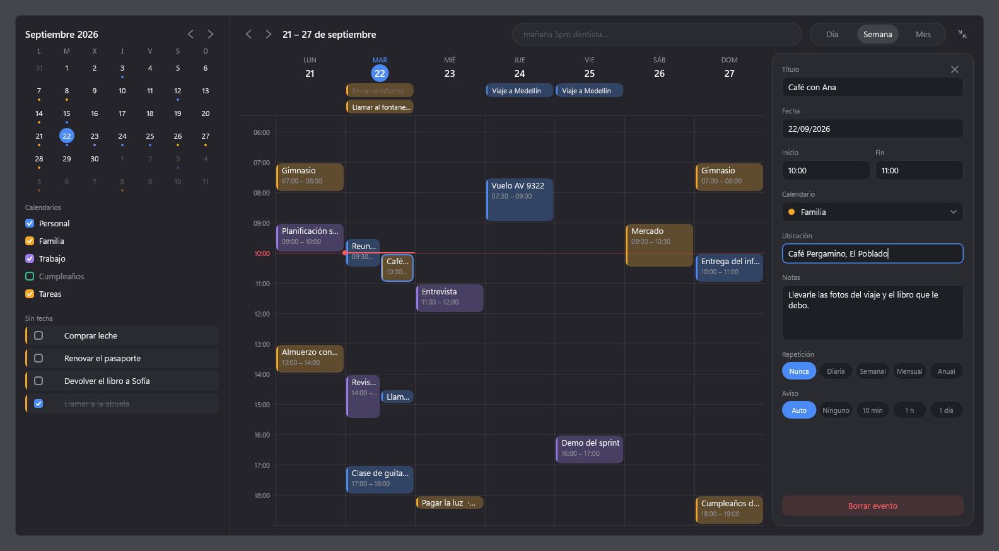 | 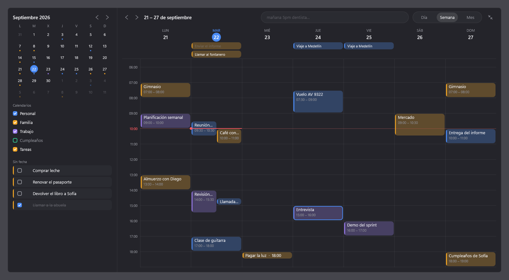 | 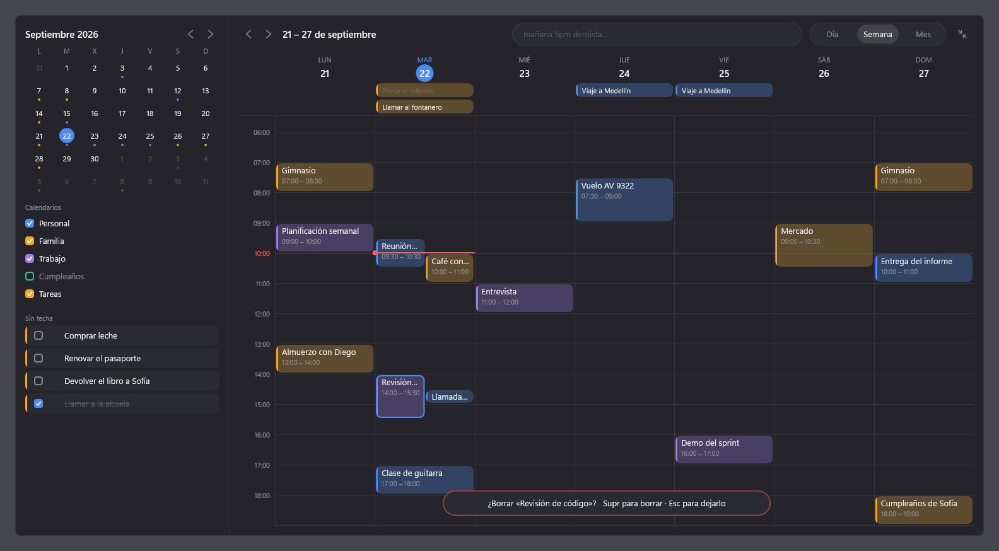 |

Un clic en la cabecera de un día de la semana abre ese día. A diferencia del popup, la app no
se cierra al hacer clic en otra ventana: se queda detrás, como cualquier aplicación. El icono
de la bandeja la vuelve a traer al frente, y el atajo la cierra; la siguiente vez abre el popup.
**Se mueve arrastrando la franja de arriba** —la del título del periodo—, también a otro
monitor, aunque tenga otra escala; al contraerse cae en la esquina del monitor donde esté.

### Todos los atajos

**En cualquier sitio**

| Tecla | Qué hace |
|---|---|
| `Alt+Shift+C` | Abre y cierra el popup (se cambia en la configuración) |

**En el popup**

| Tecla | Qué hace |
|---|---|
| Escribir | Siempre va al campo de texto; `Enter` crea lo que dice la vista previa |
| `Ctrl+Z` | Deshace lo creado mientras el aviso está en pantalla, y devuelve la frase al campo |
| `Tab`, `Shift+Tab` | Campo → mes → tarjetas del día → campo |
| `←` `→` `↑` `↓` | En el mes, un día o una semana (con texto escrito, `←` `→` mueven el cursor) |
| `↑` `↓` | Con la vista previa preguntando a. m. o p. m., cambia la respuesta |
| `RePág`, `AvPág` | En el mes, el mes anterior o el siguiente |
| `Enter`, `Espacio` | En el mes, abre la app en ese día |
| `↑` `↓`, `Inicio`, `Fin` | En las tarjetas, la anterior, la siguiente, la primera o la última |
| `Espacio` | En una tarea, la marca o la desmarca |
| `Enter` | En una tarjeta, abre la app con ese evento en el panel de detalle |
| `Ctrl+Enter` | Abre la app en el día seleccionado |
| `Ctrl+,` | Configuración |
| `Esc` | Cierra el popup |

**En la app**

| Tecla | Qué hace |
|---|---|
| `D`, `S`, `M` | Vista de día, semana o mes |
| `T` | Ir a hoy |
| `←` `→` | Periodo anterior o siguiente |
| `↑` `↓` | Sin evento seleccionado, una hora arriba o abajo (en Mes, una semana); con uno, el anterior o el siguiente |
| `RePág`, `AvPág` | Una pantalla de horas arriba o abajo |
| `Tab`, `Shift+Tab` | Campo → eventos → panel de detalle → calendarios → tareas sin fecha |
| `Enter` | En un evento, abre su detalle con el cursor en el título; en Mes, abre el día |
| `Alt+↑` `Alt+↓` | Mueve el evento seleccionado un cuarto de hora |
| `Alt+←` `Alt+→` | Lo mueve un día (la vista le sigue) |
| `Ctrl+↑` `Ctrl+↓` | Acorta o alarga su final un cuarto de hora |
| `Espacio` | En un calendario, lo muestra u oculta; en una tarea sin fecha, la marca |
| `Enter` | En una tarea sin fecha, la convierte en un evento de una hora a la siguiente hora en punto |
| `Ctrl+K` | Escribir en el campo; `Enter` crea, como en el popup |
| `Supr` | Borra el evento seleccionado, después de preguntar (`Supr` otra vez confirma) |
| `Ctrl+Z` | Deshace lo último, mientras el aviso está en pantalla |
| `Ctrl+,` | Configuración |
| `Esc` | Por capas: suelta el campo, cierra el detalle, quita la selección y al final contrae |

**En el panel de detalle**

| Tecla | Qué hace |
|---|---|
| `Tab`, `Shift+Tab` | Título → fecha → inicio → fin → calendario → ubicación → notas → repetición → borrar |
| `Enter` | Guarda el campo; en las notas, `Shift+Enter` es un salto de línea |
| `Espacio`, `Enter`, `F4` | En el calendario, abre la lista; `↑` `↓` eligen y `Enter` confirma |
| `↑` `↓` | En el calendario cerrado, cambia al anterior o al siguiente |
| `←` `→` | En la repetición, cambia la opción |
| `Esc` | Cierra la lista del calendario o el panel |

**En la configuración**

| Tecla | Qué hace |
|---|---|
| `Tab`, `Shift+Tab` | De un ajuste al siguiente |
| `←` `→` | Cambia la opción del idioma, el tema o la duración, y del calendario |
| `Espacio`, `Enter` | Activa el interruptor, abre la lista o pulsa el botón; en el atajo, empieza a grabar |
| `Retroceso` | Mientras graba el atajo, vuelve a `Alt+Shift+C` |
| `Esc` | Deja de grabar, o cierra la ventana |

El anillo de foco solo aparece cuando se usa el teclado; un clic lo quita hasta la siguiente
tecla, como en Windows.

### Configuración

Se abre con **Configuración…** en el menú de la bandeja o con **Ctrl+,** en el popup y en la
app. Es una ventana normal —con su barra de título, en Alt+Tab— dibujada con los mismos colores,
letras y formas que el resto de Agenda. Todo se aplica al momento, sin botón de guardar.

| Oscuro | Claro |
|---|---|
| 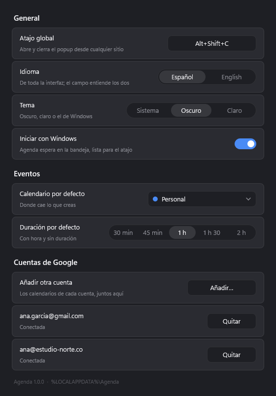 | 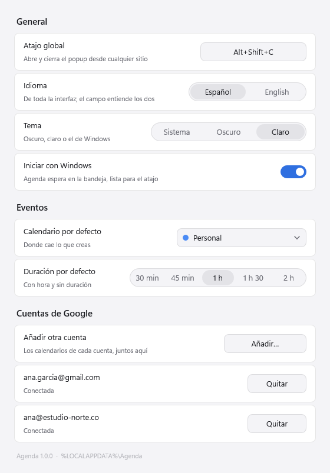 |

- **Atajo global.** Se pulsa el campo y luego la combinación. Tiene que llevar `Ctrl`, `Alt` o
  `Win`; si otra aplicación la tiene, lo dice en rojo y se queda el atajo de antes.
- **Idioma.** Español o inglés, para toda la interfaz: el popup, la app, los menús, los avisos
  y las notificaciones. El campo de texto entiende los dos siempre.
- **Tema.** Oscuro, claro o el de Windows. El alto contraste de Windows manda sobre los tres.
- **Iniciar con Windows.** Escribe o borra el valor `Agenda` de
  `HKCU\Software\Microsoft\Windows\CurrentVersion\Run`, y nada más en el registro.
- **Calendario por defecto.** Dónde cae lo que se crea; el mismo que el submenú de la bandeja.
- **Duración por defecto.** Cuánto dura un evento escrito con hora y sin duración: 30 min,
  45 min, 1 h, 1 h 30 o 2 h.
- **Cuenta de Google.** Conectar (avisa antes de abrir el navegador) o desconectar.

Se guarda en `%LOCALAPPDATA%\Agenda\config.local.json`, fusionado con lo que ya hubiera, así
que las credenciales de Google que viven en ese mismo archivo no se tocan.

### Recordatorios

Agenda avisa con una **notificación de Windows** en el minuto que dicen los recordatorios de
Google: los del propio evento o, si no tiene, los del calendario. Solo los de tipo
*notificación*; los de correo los manda Google. El calendario local, sin cuenta, avisa diez
minutos antes.

La notificación se queda en pantalla hasta que se responde, con **Posponer** (5, 10 o 30
minutos) y **Descartar**, que resuelve el propio Windows. Un clic en ella abre el popup en ese
día. Si el equipo estaba dormido, al despertar solo avisa de lo que venció en el último cuarto
de hora; lo demás ya pasó. Un calendario oculto en la barra lateral no avisa.

Si un evento se crea cuando ya pasaron todos sus recordatorios —algo a las 16:05 apuntado a las
16:00, en un calendario que avisa 30 minutos antes— avisa **una vez, al empezar**. Si no, no
diría nada nunca.

Las notificaciones nativas necesitan el acceso del menú Inicio que crea el instalador. Una build
lanzada desde su carpeta avisa con el globo de la bandeja, que Windows muestra igual.

**Con la [Isla](../isla/README.md) corriendo, el aviso va a la isla y no hay toast.** Asoma ocho
segundos con el título y la hora, y se recoge en una burbuja junto a la isla con el día del
evento en el color de su calendario, escondida tras el borde salvo su aro. Al pasar el ratón
baja, y si te quedas (o con `Ctrl+Alt+I`) crece desde ella la tarjeta con **Terminado**,
**5 min**, **10 min** y **Abrir**. Terminado cierra el aviso; los otros dos lo vuelven a dar
pasado ese rato, y Abrir trae la app con el evento abierto. Si el evento termina sin respuesta,
el aviso se retira solo. Cada proyecto funciona sin el otro: si la isla no está, o tiene ya tres
avisos esperando, Agenda saca su toast de siempre. Hablan por una tubería con nombre de la isla,
con el protocolo y sus límites en [`isla/SEGURIDAD.md` §3.7](../isla/SEGURIDAD.md).

### Accesibilidad

- **Todo con el teclado**: ver [Todos los atajos](#todos-los-atajos).
- **Narrador y demás lectores de pantalla** leen el campo de texto (y pueden escribir en él), el
  mes como un calendario de 6 × 7 con el día de hoy y los días con eventos, la lista del día con
  horas, títulos y tareas hechas, y en la app las pestañas, los eventos, los calendarios, las
  tareas sin fecha y cada campo del panel de detalle. Los avisos («Creado · Deshacer», «¿Borrar…?»)
  se anuncian al aparecer.
- **Alto contraste**: con un tema de contraste de Windows, Agenda usa los colores que eligió la
  persona, sin transparencias, y dibuja el borde de lo que antes se distinguía por un tinte.
  Cambia al momento, sin reiniciar.
- Respeta **«Efectos de animación»** desactivado: sin fundidos ni muelle.

| Semana con alto contraste |
|---|
| 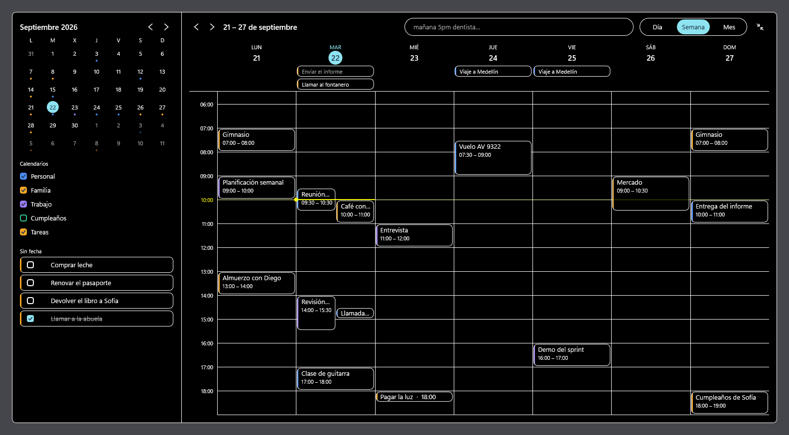 |

### Rendimiento

Medido el 22 de septiembre de 2026 con la versión instalada, en un portátil con pantalla al
125 % y GPU NVIDIA, 30 aperturas seguidas pulsando el atajo:

| Qué | Mediana | p95 |
|---|---|---|
| Del atajo a la ventana visible (`ShowWindow`) | 5 ms | 9 ms |
| Del atajo al primer fotograma compuesto | 17 ms | 23 ms |
| Del atajo al primer fotograma del fundido | 34 ms | 40 ms |

En reposo en la bandeja, 30 s después de cerrarse: **0,9 MB** de memoria privada en uso (lo
que enseña el Administrador de tareas), 2,3 MB de *working set* y 54,5 MB de bytes privados,
que son casi todos reservas del controlador gráfico. Al ocultarse, Agenda devuelve sus páginas a
Windows y el búfer de la ventana vuelve al tamaño del popup; lo primero no se nota en la
apertura siguiente, como dicen las cifras de arriba.

### Escribir en lenguaje natural

Se escribe la frase entera de corrido, en español o en inglés, sin importar el orden ni los
acentos ni las mayúsculas. Los trozos que Agenda reconoce se pintan en azul dentro del campo, y
lo que queda sin pintar es el título. Encima aparece una tarjeta con lo que se va a crear:


| Escribes | Sale |
|---|---|
| `mañana 5pm dentista` | 📅 Mañana · 17:00–18:00 · Dentista |
| `hoy 17:00 dentista` | 📅 Hoy · 17:00–18:00 · Dentista |
| `dentista el viernes a las 3 de la tarde por 2h` | 📅 Viernes · 15:00–17:00 · Dentista |
| `pasado mañana 9 reunión con Ana` | 📅 Pasado mañana · 09:00–10:00 · Reunión con Ana |
| `de 3 a 5 repaso` | 📅 Hoy · 15:00–17:00 · Repaso |
| `el 25 almuerzo` | ☑ Tarea · 25 Oct · Almuerzo |
| `en 3 días pagar el arriendo` | ☑ Tarea · Viernes · Pagar el arriendo |
| `comprar leche` | ☑ Tarea sin fecha · Comprar leche |
| `t: pagar luz el lunes` | ☑ Tarea · Lunes · Pagar luz |
| `gym cada lunes 7am` | 📅 Lunes · 07:00–08:00 · Cada semana · Gym |

Una frase que se repite guarda su regla y el evento sale **en cada día en que cae**: `gym cada
lunes 7am` aparece todos los lunes desde el primero.

La fecha se escribe como «Hoy», «Mañana», «Pasado mañana» o el día de la semana si cae dentro
de los próximos siete días, y como `25 Oct` si queda más lejos.

Lo que entiende:

- **Fechas:** `hoy`, `mañana`, `pasado mañana`, `lunes`…`domingo`, `próximo lunes`, `el 25`,
  `en 3 días`. En inglés: `today`, `tomorrow`, `day after tomorrow`, `monday`…`sunday`,
  `next monday`, `on the 25th`, `in 3 days`.
- **Horas:** `5pm`, `5 pm`, `17:00`, `17h`, `a las 5`, `5 de la tarde`, `mediodía`,
  `medianoche`. En inglés: `at 5`, `noon`, `midnight`.
- **Duración:** `por 2h`, `30 min`, `de 3 a 5`. En inglés: `for 2h`, `from 3 to 5`.
- **Repetición:** `cada lunes`, `todos los días` (`every monday`, `every day`), que se guardan
  como una regla RRULE.
- **Prefijos:** `t:` o `!` al principio obligan a que sea una tarea; `e:` obliga a que sea un
  evento.

Las reglas cuando la frase no lo dice todo:

- Si hay hora, sale un **evento** de una hora. Si no la hay, sale una **tarea**. El prefijo
  manda sobre las dos.
- Una hora sin `am` ni `pm` (`a las 3`, `4:05`) podría ser de mañana o de tarde. **Hoy vale la
  que todavía no ha pasado**: `hoy a las 5` dicho a las diez son las 17:00, y `4:05` escrito a
  las 16:00 son las 16:05. Si las dos siguen por delante, o el día es otro, la vista previa
  **pregunta a. m. o p. m.** con la más probable marcada —la que cae entre las 8:00 y las
  20:00— y se cambia con un clic o con `↑` `↓`. `04:05`, `16:05`, `4pm` y `de la tarde` dicen
  cuál es y no preguntan.

  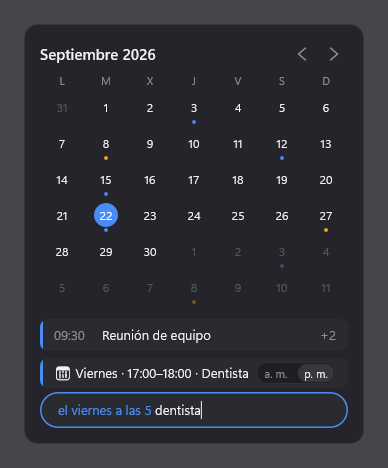
- Si las dos ya pasaron y no se escribió fecha, se usa mañana. Pero si la fecha está escrita,
  se respeta: `hoy 17:00` sigue siendo hoy aunque sean las once de la noche.
- `el 25` es el próximo 25 que haya: el de este mes si no ha pasado, y si no el del siguiente,
  saltando de año en diciembre y saltando los meses que no tienen ese día.
- Un día de la semana suelto puede ser hoy (`martes` un martes es hoy); `próximo martes` es
  siempre la semana que viene.
- Lo que no se entiende no se pierde: se queda en el título. `25:00 reunión` es una tarea
  titulada «25:00 reunión», no las once de la noche.

### Opciones de línea de comandos

- `--monitor=N` fija el monitor por su número de Windows, es decir el dispositivo
  `\\.\DISPLAYN`. El orden de enumeración **no** es ese número.
- `AGENDA_DEV_MONITOR=N` hace lo mismo, y `--monitor` tiene prioridad.
- En builds Debug el valor por defecto es 3, que es el monitor de desarrollo. En Release, sin
  argumento ni variable, el popup y la configuración se abren en el monitor donde está el
  ratón en ese momento, sea con el atajo o desde la bandeja.
- `--theme=dark`, `--theme=light` o `--theme=contrast` fuerza un tema por encima de la
  configuración. `contrast` usa los colores del alto contraste de Windows si está activo, y si
  no los de «Contraste nocturno», para que la captura sea la misma en cualquier equipo.
- `--panel=WxH` fuerza el tamaño del panel en DIP, por ejemplo `--panel=453x560`, en vez de
  calcularlo desde el monitor. Sirve para juzgar en una pantalla un tamaño que esa pantalla no
  produciría, y vale tanto para la app como para `--render-snapshot`.
- `--text=...` deja el campo de texto ya escrito. Solo tiene sentido con `--render-snapshot`,
  que es la única forma de ver la vista previa en un PNG. Si la frase lleva espacios hay que
  entrecomillarla, y en PowerShell las comillas van **dentro** del argumento:
  `Start-Process ... -ArgumentList '--render-snapshot=popup','"--text=mañana 5pm dentista"'`.
- Si el monitor indicado no está conectado, se registra el error y el proceso termina con
  código **2**. No hay fallback silencioso a otro monitor. Si ya hay otra instancia
  ejecutándose, termina con código **1**.

### Capturas de las vistas

```
build\debug\Agenda.exe --render-snapshot=popup --theme=dark  --out=docs\img\popup.png
build\debug\Agenda.exe --render-snapshot=popup --theme=light --out=docs\img\popup-claro.png
build\debug\Agenda.exe --render-snapshot=popup "--text=mañana 5pm dentista" --out=docs\img\popup-preview.png
build\debug\Agenda.exe --render-snapshot=popup-creado --out=docs\img\popup-creado.png
build\debug\Agenda.exe --render-snapshot=app-semana --theme=dark  --out=docs\img\app-semana.png
build\debug\Agenda.exe --render-snapshot=app-mes    --theme=light --out=docs\img\app-mes-claro.png
build\debug\Agenda.exe --render-snapshot=app-transicion --out=docs\img\app-transicion.png
build\debug\Agenda.exe --render-snapshot=configuracion --theme=dark --out=docs\img\configuracion.png
build\debug\Agenda.exe --render-snapshot=popup --theme=contrast --out=docs\img\popup-contraste.png
```

`configuracion` pinta el área de cliente de la ventana de configuración, con una cuenta
conectada y los calendarios de ejemplo. Las capturas salen en el idioma que diga la
configuración.

La app tiene siete vistas más: `app-dia`, `app-semana` y `app-mes`, a su tamaño de diseño de
1536×826 DIP (el 80 % de un área de trabajo de 1920×1032); `app-transicion`, que pinta la
ventana a mitad de la expansión sobre esa área de trabajo entera para poder juzgar cómo se
reorganiza; y `app-detalle`, `app-arrastre` y `app-borrar`, la semana con el panel de detalle
abierto, con un evento a medio arrastrar y con la pregunta de borrar. Llevan una semana de
ejemplo propia, con solapes, días enteros y una repetición.

| | Tema oscuro | Tema claro |
|---|---|---|
| Día | 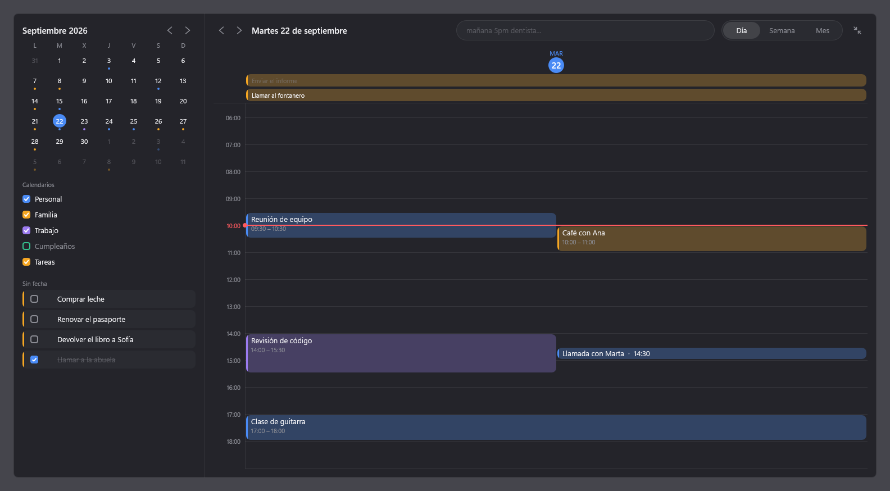 | 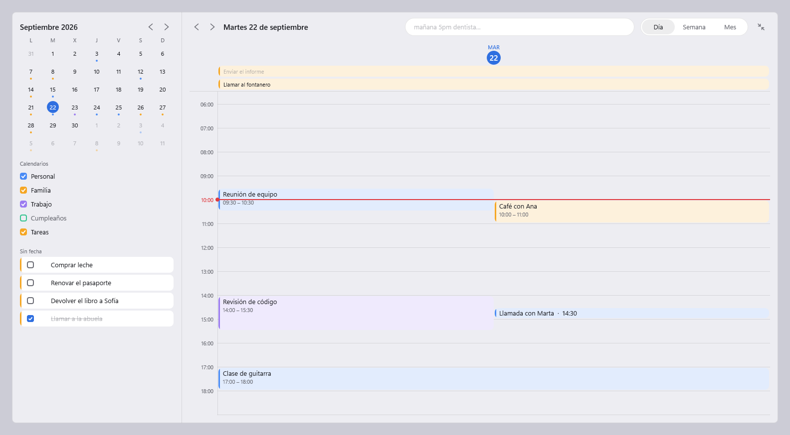 |
| Mes | 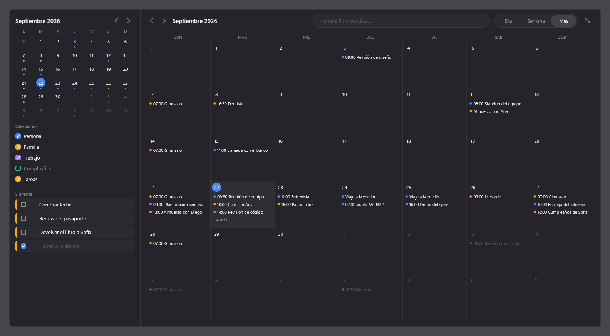 | 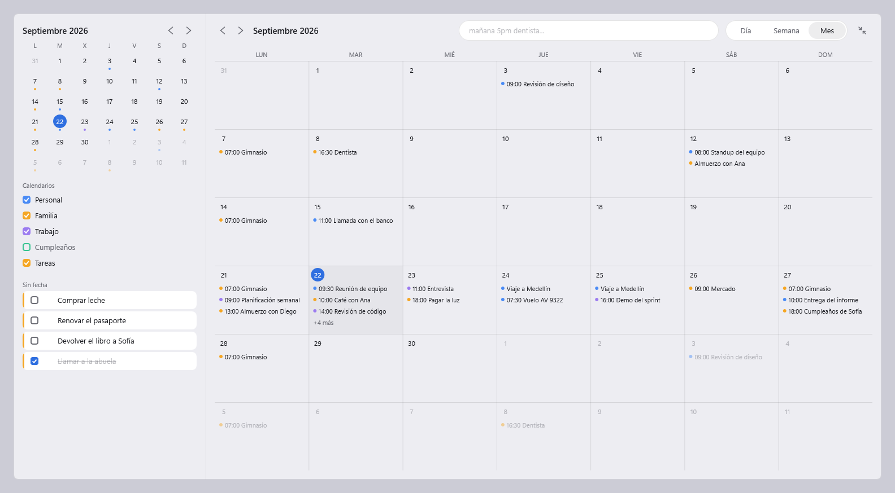 |

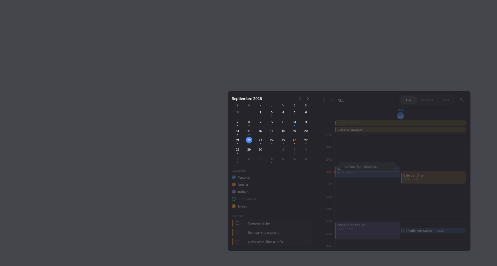

Las vistas del popup son tres: `popup` es el panel tal como se abre, `popup-creado` es el instante siguiente
a pulsar Enter —con el aviso puesto y la tarjeta nueva a medio subir— y `popup-sin-conexion`
es el mismo panel con el punto de sin conexión encendido. La segunda existe porque ese momento
dura ciento sesenta milisegundos y no hay otra forma de mirarlo con calma; la tercera, porque
el punto es tan discreto que hay que poder juzgarlo sin desenchufar nada.


Renderiza la vista fuera de pantalla con Direct2D sobre un bitmap WIC, guarda el PNG y sale.
Así se revisa el diseño: **no con capturas del escritorio**. No necesita monitor ni que la
instancia esté libre, así que funciona con la app abierta. Si falta `--out`, escribe
`shot.png`. Como el acrylic no existe fuera de pantalla, el PNG lleva detrás un gris neutro
que hace su papel, más claro u oscuro según el tema. La captura fija el 22 de septiembre de
2026 a las 10:00 como «ahora» y el panel en su tamaño base de 340×420, para que el PNG solo
cambie cuando cambie el diseño y no cuando cambien el monitor ni la hora.

Ojo: por eso mismo la captura se renderiza siempre a 96 ppp y **no sirve para revisar el
escalado**. Los fallos de DPI solo se ven con la app abierta en un monitor escalado.

Es un ejecutable de subsistema Windows, así que no devuelve el control a la consola: en
PowerShell conviene lanzarlo con `Start-Process ... -Wait` si hace falta esperar al archivo.

### Datos en disco

- Agenda: `%LOCALAPPDATA%\Agenda\agenda.db`, una base SQLite en modo WAL (de ahí los archivos
  `agenda.db-wal` y `agenda.db-shm` al lado). Dentro van los eventos, las tareas, los
  calendarios, el estado de sincronización y la cola de operaciones pendientes de subir.
  Las horas se guardan como **reloj de pared local** —un día y un minuto de ese día—, que
  es lo que guarda también Google Calendar. Desde la 1.0.0 guarda también los recordatorios
  (esquema v3). Se crea sola la primera vez y se migra con
  `PRAGMA user_version`; una base escrita por una versión más nueva de Agenda no se toca.
- Token de Google: `%LOCALAPPDATA%\Agenda\token.bin`, el *refresh token* cifrado con
  **DPAPI**. Va atado a la cuenta de Windows: copiarlo a otro equipo o a otro usuario no sirve
  de nada. Borrarlo es desconectar. El *access token* no se escribe en ningún sitio.
- Log: `%LOCALAPPDATA%\Agenda\logs\agenda-AAAAMMDD.log` (UTF-8, un archivo por día).
- Programa instalado: `%LOCALAPPDATA%\Programs\Agenda` (`Agenda.exe` y `Desinstalar.exe`).
- Configuración: `config.json` y, opcionalmente, `config.local.json`, primero junto al
  ejecutable y después en `%LOCALAPPDATA%\Agenda`. Se fusionan en ese orden, así que el
  archivo local manda. Los dos pueden faltar. **`config.local.json` guarda los secretos y
  nunca se sube al repositorio.**

| Clave | Por defecto | Qué hace |
|---|---|---|
| `hotkey` | `"Alt+Shift+C"` | Atajo global. Combina `Ctrl`, `Alt`, `Shift` y `Win` con una letra, un dígito, `F1`–`F24`, `Space`, `Enter`, `Tab` o `Esc`. |
| `language` | `"es"` | `"es"` o `"en"`: el idioma de la interfaz. |
| `theme` | `"system"` | `"system"`, `"dark"` o `"light"`. |
| `defaultDuration` | `60` | Minutos de un evento con hora y sin duración: 30, 45, 60, 90 o 120. |
| `popup.openMs` | `160` | Duración de la animación de apertura, en milisegundos. |
| `popup.closeMs` | `120` | Duración de la de cierre. |
| `google.clientId` | — | El ID de cliente OAuth. Sin él, Agenda es un calendario local y el menú de la bandeja no menciona Google. |
| `google.clientSecret` | — | El secreto de cliente. Va en `config.local.json`, nunca en el repositorio. |

`config.example.json` es la plantilla con todas las claves y sus valores por defecto: se copia,
se rellena y se guarda como `config.local.json` en `%LOCALAPPDATA%\Agenda`. La plantilla se
versiona porque no lleva nada dentro; el archivo con los valores, no.

```json
{
  "hotkey": "Ctrl+Alt+Space",
  "language": "en",
  "popup": { "openMs": 160, "closeMs": 120 }
}
```

Todas menos las de `popup` y `google` se cambian también desde la ventana de configuración,
que es la forma normal de hacerlo.

Si Windows tiene desactivadas las animaciones (Configuración → Accesibilidad → Efectos
visuales), el popup aparece y desaparece sin animación.

### Sincronización con Google

Las credenciales las creas tú: los pasos están en
[docs/google-setup.md](docs/google-setup.md), y el `clientId` y el `clientSecret` van a
`config.local.json`. Sin ellos Agenda funciona igual, solo que en este equipo, y el menú de la
bandeja no menciona Google en vez de ofrecer algo que no puede funcionar.

Con las credenciales puestas, **Conectar con Google…** abre un aviso que dice que se va a abrir
el navegador y espera confirmación. El permiso se pide con OAuth 2.0 y PKCE, y la respuesta
vuelve a `http://127.0.0.1` en un puerto libre que se cierra en cuanto llega. Se piden tres
permisos y ninguno más: escribir eventos, leer la lista de calendarios —de ahí salen los
nombres y los colores— y las tareas.

Cuándo sincroniza:

- Al abrir el popup, si hace más de **60 segundos** de la última vez.
- Cada **5 minutos** en segundo plano.
- **De inmediato** después de crear, marcar o deshacer algo; ahí solo sube, no baja.

La interfaz nunca espera a la red: todo eso ocurre en un hilo aparte y el popup sigue
apareciendo en menos de 100 ms leyendo la caché local.

Qué se sincroniza:

- **Los calendarios que tengas marcados** en Google Calendar web. El que escondiste allí lo
  escondiste a propósito. **El color de cada evento es el de su calendario.**
- **Eventos** de forma incremental, con `syncToken`. La primera vez baja el calendario entero,
  porque Google no da un `syncToken` a una consulta que lleve un rango de fechas.
- **Tareas** con `updatedMin`.
- En un conflicto **gana el cambio más reciente**, y cada conflicto queda escrito en el log.

**Calendario por defecto**: dónde cae lo que creas. Se elige en el submenú de la bandeja, que
lista tus calendarios con una marca en el activo. Lo que hubieras creado antes de conectar la
cuenta no se queda huérfano: en la primera sincronización se sube al calendario elegido.

**Sin conexión** no se pierde nada. Lo que escribes se guarda en la caché igual que siempre y
queda en una cola; la cabecera del popup enseña un punto pequeño a la izquierda de las flechas,
y nada más, porque no hay nada que hacer al respecto. Cuando la red vuelve, la cola se vacía
sola. Cerrar y volver a abrir Agenda no la pierde: vive en SQLite.


Dos límites que conviene saber:

- **Google Tasks no guarda la hora de una tarea.** Solo el día. Agenda conserva la hora en
  local mientras el día no cambie, pero en el móvil esa tarea no tendrá hora.
- **Las repeticiones se despliegan** en los días en que caen: diarias, semanales (con sus
  días), mensuales y anuales, con intervalo, número de veces o fecha final. Lo que Agenda no
  sabe leer —«el primer martes de cada mes»— se queda en su primer día, y las excepciones que
  se hagan en Google a una sola repetición todavía no se reflejan aquí.

## Preguntas frecuentes

**Pulso el atajo y no pasa nada.** Otra aplicación lo tiene: al arrancar, Agenda lo dice con un
globo en la bandeja. Ábrela desde el icono y elige otro en *Configuración → Atajo global*.

**No veo el icono en la bandeja.** Windows 11 esconde los iconos nuevos detrás de la flecha `^`
junto al reloj; arrástralo a la barra o actívalo en *Configuración de Windows →
Personalización → Barra de tareas → Otros iconos de la bandeja del sistema*. El atajo funciona
igual.

**No me llegan las notificaciones.** Hace falta haber instalado con `Instalar-Agenda.exe` (el
acceso del menú Inicio es lo que Windows usa para identificarla) y que las notificaciones de
Agenda estén activadas en *Configuración de Windows → Sistema → Notificaciones*. Con «No
molestar» activo, Windows las guarda en el centro de notificaciones sin mostrarlas.

**Conecté Google y a la semana dejó de sincronizar.** El proyecto de Google Cloud está en modo
*Prueba*, que caduca el permiso a los siete días. Publícalo, como explica
[docs/google-setup.md](docs/google-setup.md), y vuelve a conectar desde la configuración.

**¿Dónde están mis datos? ¿Se pierden al desinstalar?** En `%LOCALAPPDATA%\Agenda`. Desinstalar
no los toca salvo que marques «Borrar también mis datos».

**¿Funciona sin conexión?** Sí. Todo se guarda en local y sube solo cuando vuelve la red; un
punto pequeño en la cabecera del popup lo indica.

**¿Por qué no se cambia de tamaño la app?** Ocupa el 80 % del área de trabajo del monitor, como
decisión de diseño; sí se puede mover arrastrando su franja superior.

**Quiero la interfaz en inglés.** *Configuración → Idioma → English*. El campo de texto sigue
entendiendo español e inglés a la vez.

**¿Cómo la quito del arranque sin desinstalarla?** *Configuración → Iniciar con Windows*, o
desde *Administrador de tareas → Aplicaciones de arranque*.

## Estructura del proyecto

```
src/
  app/      entrada (wWinMain), atajo global, bandeja, monitores, argumentos y notificaciones
  ui/       popup y app expandida, configuración, render D2D, composición, muelle, capturas
            y UI Automation
  nlp/      parser de lenguaje natural (biblioteca estática, sin nada de interfaz dentro)
  data/     SQLite, esquema, modelos y repositorios (biblioteca estática, por lo mismo)
  sync/     OAuth y clientes de Google Calendar y Tasks
  core/     logging, configuración, idioma, arranque con Windows, rutas y utilidades
  installer/ el instalador y desinstalador (Instalar-Agenda.exe)
tests/      pruebas con Catch2
assets/     manifiesto (DPI Per-Monitor v2) e iconos
docs/       capturas y decisiones de arquitectura
```

## Hoja de ruta

| Fase | Qué entrega | Estado |
|---|---|---|
| 0 | Esqueleto que compila, documentación, logging, configuración y regla de monitores | Hecha |
| 1 | Ventana popup con fondo acrylic, atajo global e icono en la bandeja | Hecha |
| 2 | Sistema de diseño y vista de mes compacta con datos de ejemplo | Hecha |
| 3 | Parser de lenguaje natural con vista previa en vivo | Hecha |
| 4 | Almacenamiento en SQLite: eventos, tareas y caché local | Hecha |
| 5 | Sincronización con Google Calendar y Google Tasks (OAuth) | Hecha |
| 6 | Expansión animada a la app completa con vistas de día, semana y mes | Hecha |
| 7 | Configuración, recordatorios, accesibilidad, DPI mixto, rendimiento e instalador (1.0.0) | Hecha |

El detalle de cada fase vive en el plan de fases del proyecto.
