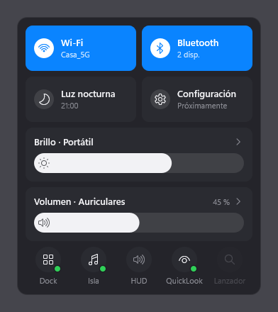
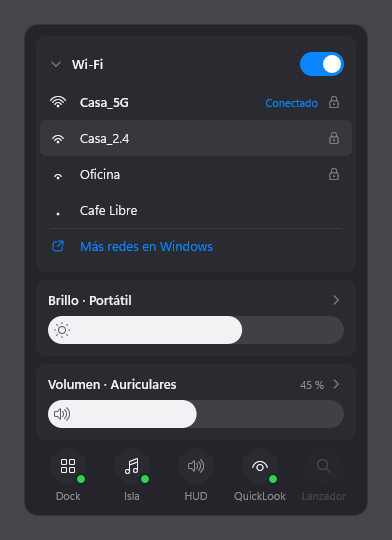
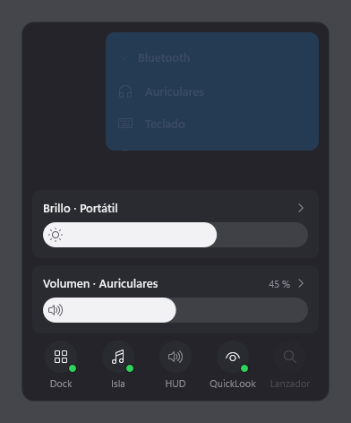
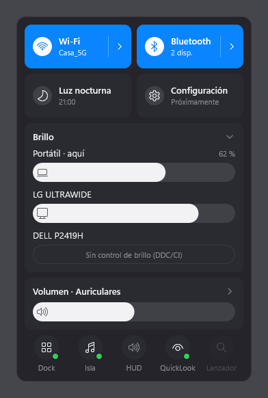
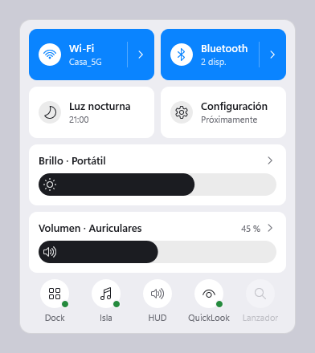

# Panel

Un centro de control al estilo de macOS para Windows 11. Pulsas **`Ctrl+Alt+A`** y aparece
abajo a la derecha, encima de la bandeja, en la pantalla donde tengas el ratón. Lleva Wi-Fi,
Bluetooth, luz nocturna, brillo, volumen y un interruptor para cada utilidad de esta carpeta.



> **Estado: fase 5 de 8** (la 4b, monitores externos, espera a probarse con las tres
> pantallas). El panel se usa entero con el ratón y con el teclado. Ya es de verdad:
> - **el volumen:** nivel, silencio, el nombre de la salida (y la sigue si cambias de
>   dispositivo) y la lista de salidas para elegir otra;
> - **el brillo de la pantalla del portátil,** que también sigue las teclas Fn;
> - **Wi-Fi y Bluetooth:** encender y apagar, la red a la que estás conectado y cuántos
>   dispositivos Bluetooth hay conectados. Clic derecho en su tile abre su página de
>   Configuración.
>
> Todavía son datos de ejemplo: los monitores externos, la luz nocturna y las utilidades. El
> plan está en
> [`docs/superpowers/plans/2026-09-23-panel-de-control.md`](docs/superpowers/plans/2026-09-23-panel-de-control.md).

| Wi-Fi desplegado | Bluetooth, a mitad del morph | Brillo desplegado | Tema claro |
|---|---|---|---|
|  |  |  |  |

## Qué hay

- **Wi-Fi y Bluetooth.** Se encienden y apagan con un clic. Debajo, la red a la que estás
  conectado y cuántos dispositivos lo están. La flecha de su derecha convierte el tile en una
  tarjeta:
  - **Wi-Fi:** las redes de alrededor, con su señal. Un clic en una red guardada conecta, y una
    nueva abre la lista de Windows, que es quien pide la contraseña. **Buscar redes usa el
    permiso de ubicación** (así lo exige Windows 11 desde 24H2), y solo mientras la tarjeta
    está abierta.
  - **Bluetooth:** los dispositivos emparejados, con su icono (auriculares, teclado, ratón) y si
    están conectados. Un clic en unos auriculares o un altavoz los conecta o los desconecta,
    como el botón «Conectar» de la configuración de sonido de Windows. Teclados y ratones se
    conectan solos al encenderlos. «Añadir un dispositivo» abre la pantalla de Windows, que es
    quien empareja.
- **Luz nocturna.** El interruptor de siempre. Debajo, a qué hora se enciende sola, si tiene
  horario.
- **Configuración.** Todavía no hace nada. Algún día abrirá los ajustes de las otras
  utilidades.
- **Brillo.** Controla la pantalla donde se abrió el panel. El chevron despliega una barra
  por pantalla:
  - el portátil, por WMI;
  - los monitores externos, por DDC/CI.
- **Volumen.** Controla la salida actual, que aparece por su nombre. El chevron despliega las
  salidas para elegir otra.
- **Utilidades.** Dock, Isla, HUD, QuickLook y Lanzador: un punto verde marca las que están
  en marcha, y un clic las arranca o las cierra.

## Atajos

| Atajo | Qué hace |
|---|---|
| `Ctrl+Alt+A` | Abre o cierra el panel. Se cambia con `hotkey` en `panel.json` |
| `Esc`, `Alt+F4` o clic fuera | Esconde el panel |
| Clic derecho en el panel | Menú con «Abrir panel.json» y «Salir» |

Dentro del panel:

| Tecla | Qué hace |
|---|---|
| `Tab` / `Shift+Tab` | Pasa al control siguiente o al anterior |
| Flechas | Fuera de un deslizador, mueven el foco. Dentro, suben o bajan un 2 % |
| `RePág` / `AvPág` | En un deslizador, ±10 % |
| `Inicio` / `Fin` | En un deslizador, 0 % o 100 % |
| `Espacio` o `Enter` | Pulsa lo que tiene el foco: enciende un tile, despliega una tarjeta, elige una salida. En el volumen, silencia |

Con el ratón:
- **Tiles y utilidades:** un clic los activa.
- **Deslizadores:** un clic en la barra la lleva a ese punto, y se puede arrastrar. La rueda
  sube o baja un 2 % por muesca.
- **Silencio:** clic en el icono del altavoz.
- **Tarjetas:** se despliegan con un clic en su título.

`Win+A` no se puede usar: es el panel de Windows, y el sistema no deja que otra aplicación
lo registre.

Si otra aplicación ya tiene el atajo, el panel se abre una vez al arrancar y lo dice abajo,
en una línea.

## Configuración

`%LOCALAPPDATA%\Panel\panel.json` se crea la primera vez que eliges «Abrir panel.json».
Tiene la misma forma que [`panel.example.json`](panel.example.json):

| Clave | Por defecto | Qué es |
|---|---|---|
| `hotkey` | `"Ctrl+Alt+A"` | El atajo. Modificadores `Ctrl`, `Alt`, `Shift` y `Win`, más una letra, un número, `F1`-`F24` o `Space` |
| `language` | `"es"` | `"es"` o `"en"` |
| `theme` | `""` | `""` sigue a Windows; también `"dark"` o `"light"`. Si el alto contraste está activado, manda sobre esto |

Los cambios se aplican al volver a abrir el Panel (clic derecho → Salir, y abrirlo otra vez).

## Compilar

Hace falta Visual Studio 2022 con C++ y CMake 3.28 o más reciente. Las dos dependencias,
nlohmann/json y doctest, se descargan solas en la primera configuración, fijadas por su hash.

```
cmake --preset debug && cmake --build --preset debug
ctest --preset debug
build\debug\Panel.exe --monitor=1
build\debug\Panel.exe --render-snapshot=panel --out=docs\img\panel.png
powershell -NoProfile -ExecutionPolicy Bypass -File auditar.ps1
```

Las vistas de `--render-snapshot` son `panel`, `panel-brillo`, `panel-volumen`,
`panel-estados`, `panel-wifi`, `panel-bluetooth` y `panel-morph`. La última enseña a la vez el hover, el anillo de foco y la tarjeta de brillo a
medio abrir. `--theme` acepta `dark`, `light` y `contrast`.

## Seguridad

[`SEGURIDAD.md`](SEGURIDAD.md) recoge lo que el Panel no hará nunca y con qué cortes toca el
sistema. [`auditar.ps1`](auditar.ps1) lo comprueba contra el código.
